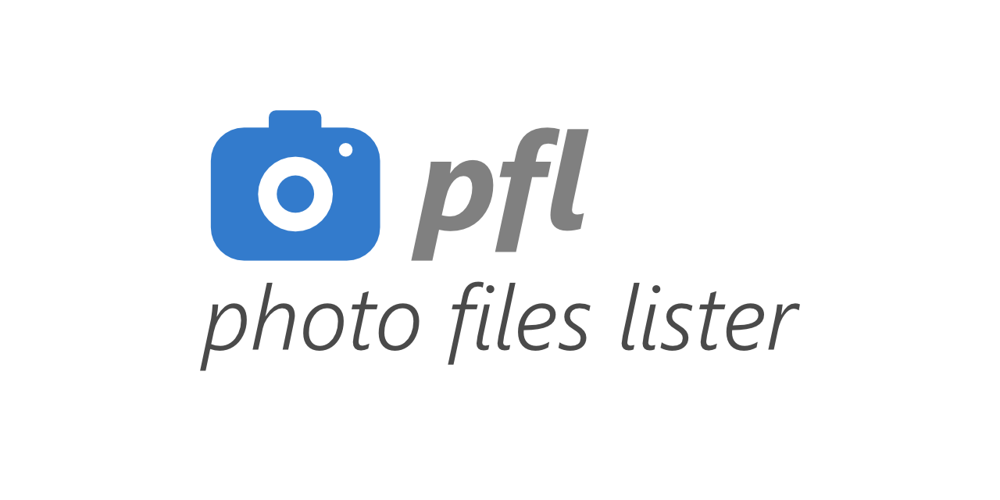

# Photography Files Lister (pfl)

This CLI tool lists photography files from well known major brands.

⚠️ **Warning: the app is not finished yet, it is under development...** ⚠️

## Extension Set

### RAW Extensions (core)

| Extension | Brand / format                                |
| --------- | --------------------------------------------- |
| `.cr2`    | Canon                                         |
| `.cr3`    | Canon                                         |
| `.arw`    | Sony                                          |
| `.nef`    | Nikon                                         |
| `.nrw`    | Nikon                                         |
| `.raf`    | Fujifilm                                      |
| `.rw2`    | Panasonic                                     |
| `.dng`    | Adobe Digital Negative, Leica, Pentax, mobile |
| `.pef`    | Pentax                                        |
| `.srw`    | Samsung                                       |
| `.orf`    | Olympus / OM System                           |
| `.x3f`    | Sigma                                         |
| `.3fr`    | Hasselblad                                    |
| `.iiq`    | Phase One                                     |
| `.rwl`    | Leica                                         |

### Compressed Photo Extensions

```
.jpg
.jpeg
.heif
.heic
```

## License

Please see [the license file](LICENSE.md).

## Links

- **Rust CLI book**: https://rust-cli.github.io/book/index.html
- **Rust Documentation**: https://doc.rust-lang.org/
- **Clap CLI**: https://docs.rs/clap/
- **Anyhow**: https://docs.rs/anyhow/

## History

- Added more RAW format extensions in August 2026.
- Started in January, 2026.
